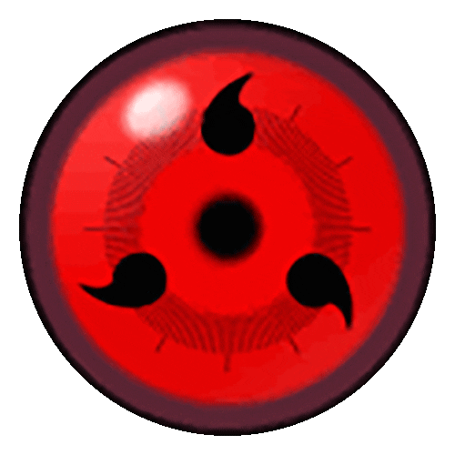

<!-- -->

<h1 align="center">Hey 👋 What's up?</h1>

###

<!--

My name is Amr Samy and I'm a from Egypt

-->

## <picture></picture> **About me**

###

🐞 Creating bugs since 2017 
💻 Software engineer focused on building meaningful, user-friendly mobile experiences. 
🚀 Passionate about crafting apps that solve real-world problems. 
📚 Currently mastering cross-platform development with Flutter, focusing on performance and clean UI. 
🔍 A research-driven developer — I believe every bug has a solution if you’re curious enough to find it. 
🎯 I love project planning as much as coding — clear timelines are my happy place. 
🤓 I probably have more open tabs than I should. 

## <picture></picture> **Skills**

 

  
  
  
  
   
  
  
  
  
  
  
  
    
  
   
  
  
  
    
  
  
  
  
  
  

## <picture></picture> **Tools I use**
 

  
  
  
  
  
  
  
  
  
  
  
  
  

###

<h2 align="left">:test_tube: Looking forward to try</h2>

###

 

<!--   
   -->
  
  
  
  
  
  
  
  
  

###

## <picture></picture> **Github Stats**

  
  
  <!--
  
  -->
  

  

###

## <picture></picture> **Profile Views**

  

###
## <picture></picture>**Let's Connect..!**

  

  

<!--
## :memo: **Articles**
  

    
  

-->
<!--
## :notes: Music

  

-->

  

